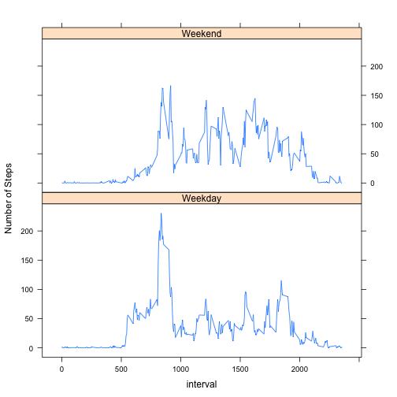

# Reproducible Research: Peer Assessment 1

## Loading and preprocessing the data
Data is loaded into a variable named **data** and the **date** column which type is *integer*, is changed to type *date*

```r
data <- read.csv("activity.csv")
data$date <- as.Date(data$date)
```


## What is the mean total number of steps taken per day?
Histogram of the variable *total number of steps taken each day*


```r
stepsByDay <- tapply(data$steps, data$date, sum)
hist(stepsByDay, xlab = "Number of steps", main = "Histogram of steps by day")
```

 

**Mean** of steps taken

```r
mean(stepsByDay, na.rm = TRUE)
```

```
## [1] 10766
```

**Median** of steps taken

```r
median(stepsByDay, na.rm = TRUE)
```

```
## [1] 10765
```

## What is the average daily activity pattern?
Time series plot of the 5-minute interval (*x-axis*) and the average number of steps taken, averaged across all days (*y-axis*)

```r
stepsByInt <- subset(data, select = c(steps, interval))
stepsByInt <- aggregate(stepsByInt$steps, list(stepsByInt$interval), mean, na.rm = TRUE)
plot(stepsByInt$Group.1, stepsByInt$x, type = "l", xaxt = 'n', xlab = "Time (Hour)", ylab = "Avg Number of Steps", main = "Avg Number of Steps by Time of Day")
axis(1, labels = c('0:00', '5:00', '10:00', '15:00', '20:00'), at = c(0, 500, 1000, 1500, 2000))
```

 

The 5-minute interval that on average across all the days in the dataset, contains the maximum number of steps

```r
interval <- subset(stepsByInt, stepsByInt$x == max(stepsByInt$x))
interval$Group.1
```

```
## [1] 835
```

Value (Maximum number of steps):

```
## [1] 206.2
```

## Imputing missing values
Total number of missing values in the dataset (i.e. the total number of rows with NAs)

```r
number <- sum(rowSums(is.na(data)))
number
```

```
## [1] 2304
```

Strategy used for filling in all of the missing values in the dataset: The mean for each 5-minute interval

```r
newData <- data
for(i in 1:nrow(newData)){
  if(is.na(newData$steps[i])){
    newData$steps[i] = stepsByInt[stepsByInt[1] == newData$interval[i], 2]
  }
}
```
As can be seen, the new dataset does not have NA's values

```r
summary(newData)
```

```
##      steps            date               interval   
##  Min.   :  0.0   Min.   :2012-10-01   Min.   :   0  
##  1st Qu.:  0.0   1st Qu.:2012-10-16   1st Qu.: 589  
##  Median :  0.0   Median :2012-10-31   Median :1178  
##  Mean   : 37.4   Mean   :2012-10-31   Mean   :1178  
##  3rd Qu.: 27.0   3rd Qu.:2012-11-15   3rd Qu.:1766  
##  Max.   :806.0   Max.   :2012-11-30   Max.   :2355
```

Histogram of the variable *total number of steps taken each day* comparison based on the **data** and **newData** datasets

```r
stepsByDay2 <- tapply(newData$steps, newData$date, sum)
par(mfrow = c(1,2))
hist(stepsByDay, xlab = "Number of steps", main = "Histogram of steps by day")
hist(stepsByDay2, xlab = "Number of steps", main = "Histogram without NA's")
```

 

**Mean** of steps taken **(no NA's)**

```r
mean(stepsByDay2)
```

```
## [1] 10766
```

**Mean** of steps taken **(with NA's)**

```
## [1] 10766
```

**Median** of steps taken **(no NA's)**

```r
median(stepsByDay2)
```

```
## [1] 10766
```

**Median** of steps taken **(with NA's)**

```
## [1] 10765
```

Comparing the mean and median values calculated based on the original dataset and the dataset with no NA's, **there are no significant differences**.  
In the dataset with no NA's, there are more 2304 values (steps) in analysis, therefore as expected, the respective histogram shows higher frequency values. That affects slightly the median value, being these the only differences between the two histograms. 

## Are there differences in activity patterns between weekdays and weekends?
New factor variable added to the dataset with two levels – **Weekday** and **Weekend** indicating whether a given date is a weekday or weekend day.

```r
week <- weekdays(data$date, abbreviate = TRUE)
for(i in 1:length(week)){
  if(week[i] == "Sáb" | week[i] == "Dom"){
    week[i] = "Weekend"
  }
  else{
    week[i] = "Weekday"
  }
}

newData <- cbind(newData, week)
```

Time series plot of the 5-minute interval (x-axis) and the average number of steps taken, averaged across all weekday days or weekend days (y-axis). 

```r
library(lattice)
stepsByInt2 <- aggregate(newData$steps, list(interval = newData$interval, week = newData$week), mean)
xyplot(x~interval | week, type = "l", layout = c(1,2), data = stepsByInt2, ylab = "Number of Steps")
```

 

As can be observed in the previous graphs, **there are significant differences** in activity patterns between weekdays and weekends.  
On weekdays there is on average more activity from the period of 500 to 1000, that corresponds to (05:00 to 10:00 o'clock). Then this tendency is inverted, with more activity being registered on Weekends from 1000 to 2000 (10:00 to 20:00 o'clock).  
This makes sense, since weekdays are labour days where people (normally) work mainly in a sitted position. On the other hand on weekends people tend to sleep until later and being more active on the rest of the day.  

## Author
This work was ellaborated by **Gabriel Mota** for the *Reproducible Research* Coursera's course.  
**15/08/2014**
