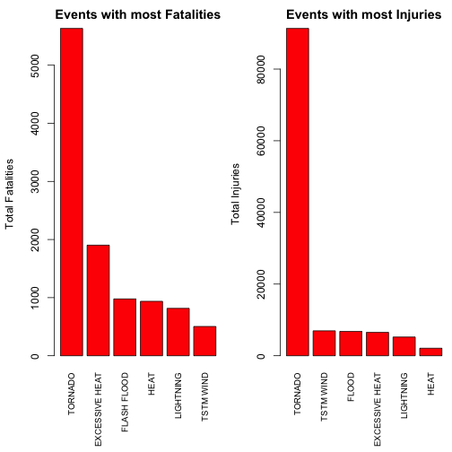
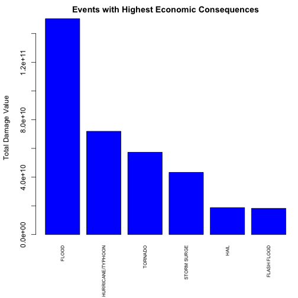

NOAA Storm Database Analysis
========================================================

## Synopsis
The aim of this project involves exploring the U.S. National Oceanic and Atmospheric Administration's (NOAA) storm database. This database tracks characteristics of major storms and weather events in the United States, including when and where they occur, as well as estimates of any fatalities, injuries, and property damage.  
The basic goal of this assignment is to explore the NOAA Storm Database and answer some basic questions about severe weather events, more precisely:  
**1.** *Which types of events across the United States, are most harmful with respect to population health?*  
**2.** *Which types of events across the United States, have the greatest economic consequences?*  
From this analysis I was able to conclude that the the most harmful event is the Tornado by a large margin, followed by Heat and Flood. Regarding the event that cause the more economic consequences, in first place, also with a high margin, is Flood, followed by Typhoon and Tornado.

## Data Processing
The [data](https://d396qusza40orc.cloudfront.net/repdata%2Fdata%2FStormData.csv.bz2) for this assignment comes in the form of a comma-separated-value file.  
The events in the database start in the year **1950** and end in November **2011**. In the earlier years of the database there are generally fewer events recorded, most likely due to a lack of good records. More recent years should be considered more complete.

Documentation of the database can be found at:

- National Weather Service [Storm Data Documentation](https://d396qusza40orc.cloudfront.net/repdata%2Fpeer2_doc%2Fpd01016005curr.pdf)

- National Climatic Data Center Storm Events [FAQ](https://d396qusza40orc.cloudfront.net/repdata%2Fpeer2_doc%2FNCDC%20Storm%20Events-FAQ%20Page.pdf)

### Reading the data
The first step of this analysis was to read the data from the CSV file in the zip archive. The data were tidy with missing values coded as 'NA'. No type of preprocessing was done.

```r
data <- read.csv("repdata-data-StormData.csv.bz2")
```
Number of rows and columns in the data

```r
dim(data)
```

```
## [1] 902297     37
```
By analyzing the first rows of the data, everything looked ok

```r
head(data)
```

```
##   STATE__           BGN_DATE BGN_TIME TIME_ZONE COUNTY COUNTYNAME STATE
## 1       1  4/18/1950 0:00:00     0130       CST     97     MOBILE    AL
## 2       1  4/18/1950 0:00:00     0145       CST      3    BALDWIN    AL
## 3       1  2/20/1951 0:00:00     1600       CST     57    FAYETTE    AL
## 4       1   6/8/1951 0:00:00     0900       CST     89    MADISON    AL
## 5       1 11/15/1951 0:00:00     1500       CST     43    CULLMAN    AL
## 6       1 11/15/1951 0:00:00     2000       CST     77 LAUDERDALE    AL
##    EVTYPE BGN_RANGE BGN_AZI BGN_LOCATI END_DATE END_TIME COUNTY_END
## 1 TORNADO         0                                               0
## 2 TORNADO         0                                               0
## 3 TORNADO         0                                               0
## 4 TORNADO         0                                               0
## 5 TORNADO         0                                               0
## 6 TORNADO         0                                               0
##   COUNTYENDN END_RANGE END_AZI END_LOCATI LENGTH WIDTH F MAG FATALITIES
## 1         NA         0                      14.0   100 3   0          0
## 2         NA         0                       2.0   150 2   0          0
## 3         NA         0                       0.1   123 2   0          0
## 4         NA         0                       0.0   100 2   0          0
## 5         NA         0                       0.0   150 2   0          0
## 6         NA         0                       1.5   177 2   0          0
##   INJURIES PROPDMG PROPDMGEXP CROPDMG CROPDMGEXP WFO STATEOFFIC ZONENAMES
## 1       15    25.0          K       0                                    
## 2        0     2.5          K       0                                    
## 3        2    25.0          K       0                                    
## 4        2     2.5          K       0                                    
## 5        2     2.5          K       0                                    
## 6        6     2.5          K       0                                    
##   LATITUDE LONGITUDE LATITUDE_E LONGITUDE_ REMARKS REFNUM
## 1     3040      8812       3051       8806              1
## 2     3042      8755          0          0              2
## 3     3340      8742          0          0              3
## 4     3458      8626          0          0              4
## 5     3412      8642          0          0              5
## 6     3450      8748          0          0              6
```
  
## Results

### Most harmful types of events across the United States, with respect to population health
In order to discover which are the most harmful types of events across the United States, with respect to population health, two relations were analysed. Being those:  
- Types of events and fatalities  
- Types of events and injuries  
Since both fatalities and injuries are related with population health.

First a dataset was created with the aggregated number of fatalities (sum) by the type of event. This dataset was then ordered in a decreasing way, and finally a new small dataset was created with the top 6 most fatal events.

```r
tf <- aggregate(data$FATALITIES, list(Event_Type = data$EVTYPE), sum)
tf <- tf[sort.list(tf$x, decreasing = TRUE),]
tff <- head(tf)
tff
```

```
##         Event_Type    x
## 834        TORNADO 5633
## 130 EXCESSIVE HEAT 1903
## 153    FLASH FLOOD  978
## 275           HEAT  937
## 464      LIGHTNING  816
## 856      TSTM WIND  504
```

The same was done regarding the injuries.

```r
ti <- aggregate(data$INJURIES, list(Event_Type = data$EVTYPE), sum)
ti <- ti[sort.list(ti$x, decreasing = TRUE),]
tif <- head(ti)
tif
```

```
##         Event_Type     x
## 834        TORNADO 91346
## 856      TSTM WIND  6957
## 170          FLOOD  6789
## 130 EXCESSIVE HEAT  6525
## 464      LIGHTNING  5230
## 275           HEAT  2100
```

Having the top 6 type of events regarding fatalities and injuries, a figure with two plots was made.

```r
##The margins were changed in order for a better display of the plots.
par(mar = c(7, 4, 2, 0.1) + 0.2)

##The screen was set to display two plots in a row
par(mfrow = c(1,2))


barplot(tff$x, names.arg = tff$Event_Type, xlab=NULL, ylab="Total Fatalities", col = "red", las=3, cex.names = 0.8, main = "Events with most Fatalities")

barplot(tif$x, names.arg = tif$Event_Type, xlab=NULL, ylab="Total Injuries", col = "red", las=3, cex.names = 0.8, main = "Events with most Injuries")
```

 

An analysis on these two barplots allow to see that Tornado have been the cause for most injuries and fatalities. If we consider Excessive Heat and Heat has a unique event type, due to their similarity in nature, then this is the number 2 cause for more injuries and fatalities. The same logic applied to Flash Fload and Fload, places it at number 3. Lightning and Tstwind appear next with very similar values.  
Therefore the top 3 most most harmful types of events across the United States, with respect to population health are:  
1. Tornado  
2. Heat  
3. Fload  

### Types of events across the United States that have the greatest economic consequences
The types of events across the United States with the greatest economic consequences, can be determined by analyzing the columns *PROPDMG*, *CROPDMG*, *PROPDMGEXP* and *CROPDMGEXP*.  
The first two columns have the values of the damages in dollars. The other two columns represent the unity of those values (1k = 1000 for example).  
The first step in this analysis is to discover what levels are represented in *PROPDMGEXP* and *CROPDMGEXP*. In the summary details present in the beginning of this document one can see that there are several levels represented as *(Other)* in these columns.  
To discover all the levels in each of these columns the *unique* function was used.  
- PROPDMGEXP

```r
unique(data$PROPDMGEXP)
```

```
##  [1] K M   B m + 0 5 6 ? 4 2 3 h 7 H - 1 8
## Levels:  - ? + 0 1 2 3 4 5 6 7 8 B h H K m M
```

- CROPDMGEXP

```r
unique(data$CROPDMGEXP)
```

```
## [1]   M K m B ? 0 k 2
## Levels:  ? 0 2 B k K m M
```

As it is possible to see, these columns needed to be cleaned. They had characters that needed to be removed, and they had their unities represented as uppercase and lowercase.

In order to clean this data, the "-", "?", "+" and "" characters were removed and the unities were substituted by the corresponding numeric exponent.


```r
data$PROPDMGEXP <- sub("^$|[-?+]", "0",data$PROPDMGEXP)
data$PROPDMGEXP <- sub("[Hh]", "2",data$PROPDMGEXP)
data$PROPDMGEXP <- sub("[Kk]", "3",data$PROPDMGEXP)
data$PROPDMGEXP <- sub("[Mm]", "6",data$PROPDMGEXP)
data$PROPDMGEXP <- sub("[Bb]", "9",data$PROPDMGEXP)
data$CROPDMGEXP <- sub("^$|[-?+]", "0",data$CROPDMGEXP)
data$CROPDMGEXP <- sub("[Hh]", "2",data$CROPDMGEXP)
data$CROPDMGEXP <- sub("[Kk]", "3",data$CROPDMGEXP)
data$CROPDMGEXP <- sub("[Mm]", "6",data$CROPDMGEXP)
data$CROPDMGEXP <- sub("[Bb]", "9",data$CROPDMGEXP)
```

After this being done it was just a matter of calculating the values by elevating them (*PROPDMG* and *CROPDMG*) to their respective exponents.

```r
data$PROPDMGEXP <- as.numeric(data$PROPDMGEXP)
data$CROPDMGEXP <- as.numeric(data$CROPDMGEXP)
data$PROPDMG <- data$PROPDMG*10^data$PROPDMGEXP
data$CROPDMG <- data$CROPDMG*10^data$CROPDMGEXP
```

Then, with the proper damage values calculated, another aggregation (sum) was made with these values (**_CROPDMG_ + _PROPDMG_**) by the type of events. Then the dataset was ordered and its top 6 displayed.

```r
dmg <- aggregate(data$CROPDMG+data$PROPDMG, list(Event_Type = data$EVTYPE), sum)
dmg <- dmg[sort.list(dmg$x, decreasing = TRUE),]
dmg1 <- head(dmg)
dmg1
```

```
##            Event_Type         x
## 170             FLOOD 1.503e+11
## 411 HURRICANE/TYPHOON 7.191e+10
## 834           TORNADO 5.736e+10
## 670       STORM SURGE 4.332e+10
## 244              HAIL 1.876e+10
## 153       FLASH FLOOD 1.824e+10
```

The following figure shows a bar plot with the 6 types of events with the greatest economic consequences, in the United States:

```r
##The margins were changed in order for a better display of the plots.
par(mar = c(7, 4, 2, 0.1) + 0.2)

barplot(dmg1$x, names.arg = dmg1$Event_Type, xlab=NULL, ylab="Total Damage Value", col = "blue", las=3, cex.names = 0.65, main = "Events with Highest Economic Consequences")
```

 

It is possible to observe that Flood is the event that causes more economic losses, followed by Typhoons and Tornados. Although if these two are considered as a single one, then Storm Surge is the 3rd cause for the greatest economic consequences.

## Author
This work was elaborated by **Gabriel Mota** for the *Reproducible Research* Coursera's course.  
**22/08/2014**
